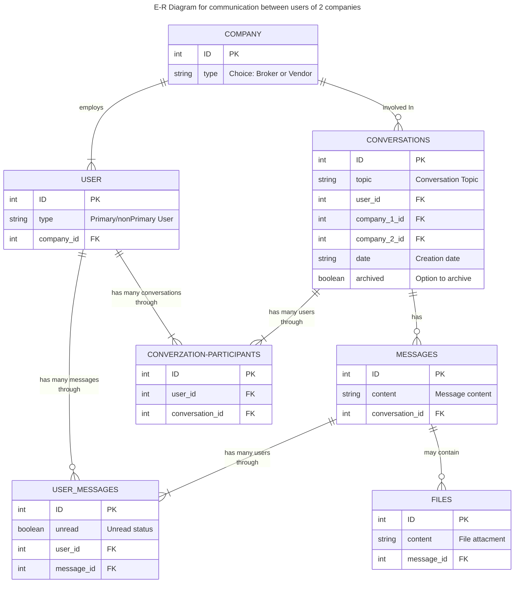

```mermaid
---
title: E-R Diagram for communication between users of 2 companies
---
erDiagram
    %% COMPANY TABLE - company details
    COMPANY {
        int ID "PK" 
        string  type "Choice: Broker or Vendor"
    }
    USER {
        int ID "PK"
        string  type "Primary/nonPrimary User"
        int company_id "FK"
    }
    CONVERSATIONS {
        int ID "PK"
        string  topic "Conversation Topic"
        int user_id "FK"
        int company_1_id "FK"
        int company_2_id "FK"
        string  date "Creation date"
        boolean archived "Option to archive"
    }
    MESSAGES {
        int ID "PK"
        string  content "Message content"
        int conversation_id "FK"
    }
    CONVERZATION-PARTICIPANTS {
        int ID "PK"
        int user_id "FK"
        int conversation_id "FK"
    }
    USER_MESSAGES {
        int ID "PK"
        boolean unread "Unread status"
        int user_id "FK"
        int message_id "FK"
    }
    FILES {
        int ID "PK"
        string content "File attacment"
        int message_id "FK"
    }
    COMPANY ||--|{ USER : employs
    COMPANY || -- o{ CONVERSATIONS: "involved In"
    USER || -- o{ USER_MESSAGES: "has many messages <br /> through"
    USER || -- |{ CONVERZATION-PARTICIPANTS: "has many conversations <br /> through"
    CONVERSATIONS ||--|{ CONVERZATION-PARTICIPANTS : "has many users <br /> through"
    CONVERSATIONS || -- o{ MESSAGES: "has"
    MESSAGES || -- |{ USER_MESSAGES: "has many users <br /> through"
    MESSAGES || -- o{ FILES: "may contain"

```